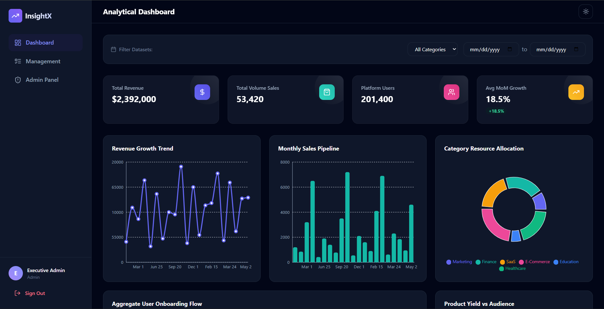
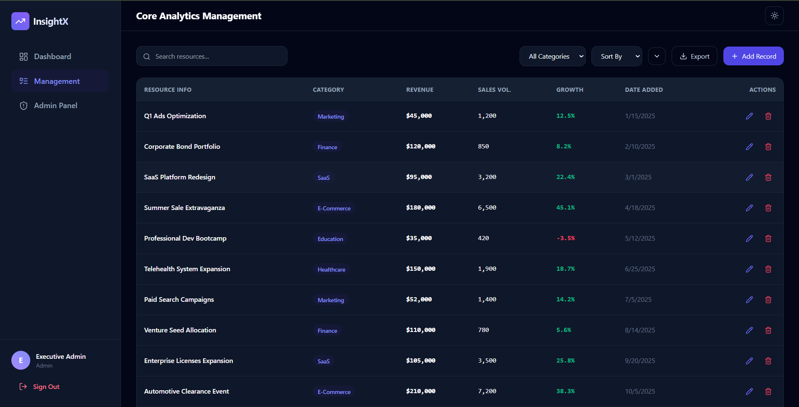
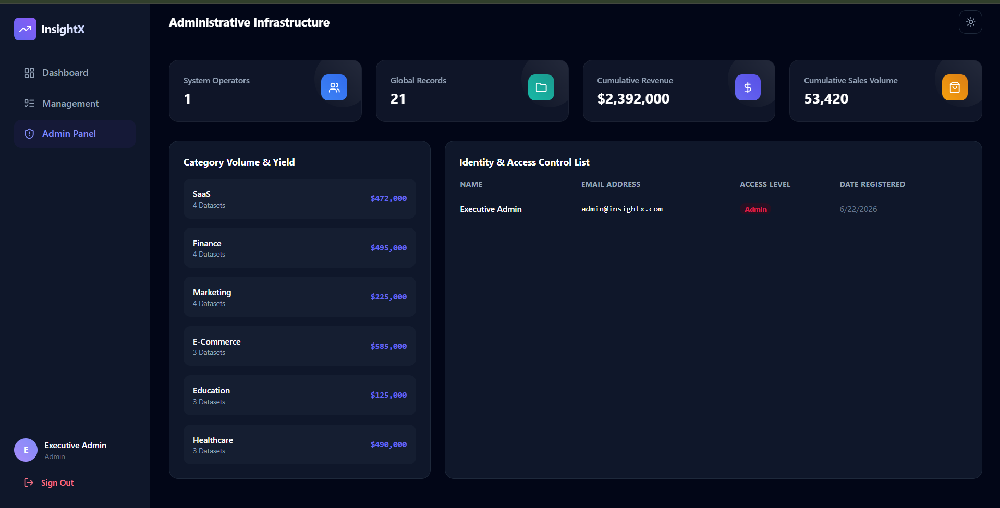

# InsightX Analytics Platform

A full-stack analytics management platform designed to provide organizations with powerful business intelligence through interactive dashboards, real-time metrics, and role-based access control. The platform enables users to manage analytical datasets, visualize key performance indicators, and monitor business growth using dynamic charts and comprehensive reporting.

## Live Demo

- **Frontend:** https://insight-x-eta.vercel.app
- **Backend API:** https://insightx-3a0a.onrender.com
- **API Health Check:** https://insightx-3a0a.onrender.com/api

---

## Features

- JWT Authentication and Authorization
- Role-Based Access Control (Admin & Analyst)
- Secure User Registration and Login
- Interactive Analytics Dashboard
- Revenue, Sales, and User Growth Metrics
- Category-wise Data Distribution Analysis
- Revenue vs Users Performance Analysis
- Analytics Record Management (CRUD Operations)
- Advanced Filtering and Search Functionality
- Responsive Dark/Light Mode Interface
- MongoDB Database Integration
- RESTful API Architecture
- Professional Admin Panel with User Management

---

## Screenshots

### Dashboard



### Analytics Management



### Admin Panel



---

## Tech Stack

### Frontend

- React.js
- Vite
- React Router DOM
- Axios
- Tailwind CSS
- Recharts
- React Icons
- React Hot Toast

### Backend

- Node.js
- Express.js
- MongoDB Atlas
- Mongoose
- JWT Authentication
- bcryptjs

### Deployment

- Vercel (Frontend)
- Render (Backend)

---

## Installation

### Clone the Repository

```bash
git clone https://github.com/rexter001/InsightX.git
cd InsightX
```

---

## Backend Setup

```bash
cd server
npm install
```

Create a `.env` file:

```env
PORT=5000
MONGO_URI=your_mongodb_connection_string
JWT_SECRET=your_secret_key
NODE_ENV=development
```

Run the backend:

```bash
npm run dev
```

Seed the database:

```bash
npm run seed
```

---

## Frontend Setup

```bash
cd client
npm install
npm run dev
```

Create a `.env` file:

```env
VITE_API_URL=http://localhost:5000/api
```

Open:

```text
http://localhost:5173
```

---

## Demo Admin Credentials

```text
Email: admin@insightx.com
Password: admin123
```

---

## Project Structure

```text
InsightX
│
├── client
│   ├── src
│   ├── components
│   ├── pages
│   ├── charts
│   ├── services
│   └── context
│
├── server
│   ├── controllers
│   ├── models
│   ├── routes
│   ├── middleware
│   ├── scripts
│   └── config
│
└── README.md
```

---

## API Endpoints

### Authentication

```http
POST /api/auth/register
POST /api/auth/login
```

### Analytics

```http
GET    /api/analytics
POST   /api/analytics
PUT    /api/analytics/:id
DELETE /api/analytics/:id
```

### Admin

```http
GET /api/admin/stats
GET /api/admin/users
```

---

## Roadmap

- Real-Time Analytics Streaming
- Export Reports (PDF/Excel)
- Email Notification System
- Advanced Business Intelligence Dashboard
- Predictive Analytics using Machine Learning
- Multi-Tenant Organization Support
- Data Import and Export Features
- Audit Logs and Activity Tracking
- API Documentation with Swagger
- Docker and Kubernetes Deployment

---

## Author

- [@Khaja Mastan Shaik](https://github.com/rexter001)